## Mermaid

**Mermaid** - это сильно упрощённый и далекий аналог
**UML** - специальный язык описания блок-схем, графиков и диаграмм с их визуализацией.

>**Самостоятельно доделать этот README**

### Блок схемы

#### Базованя структура 1
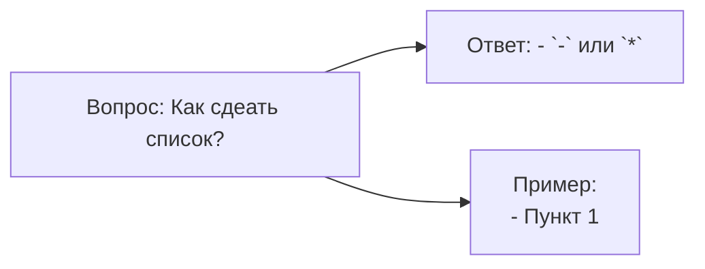
* `flowchart` - блок-схема
* `LR` - направление вправо
* `A[],B[],C[]` - прямоугольник
* `-->` - стрелка связи
#### Базовая структура 2
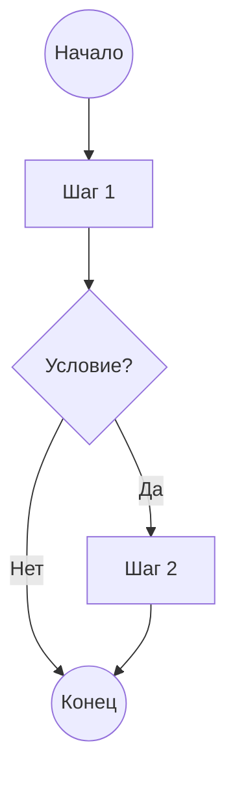

* `TD` — направление сверху вниз (Top-Down), другие варианты: `BT`, `LR`, `RL`
* `(( ))` — круг/точка старта-конца
* `{ }` — ромб (условие/решение)
* `-->|текст|` — подпись на стрелке

### Полный синтаксис блок-схем
**Формы узлов:**
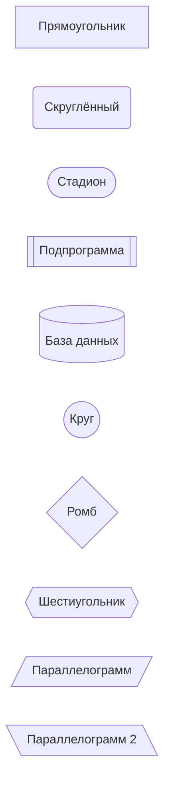

**Типы стрелок:**
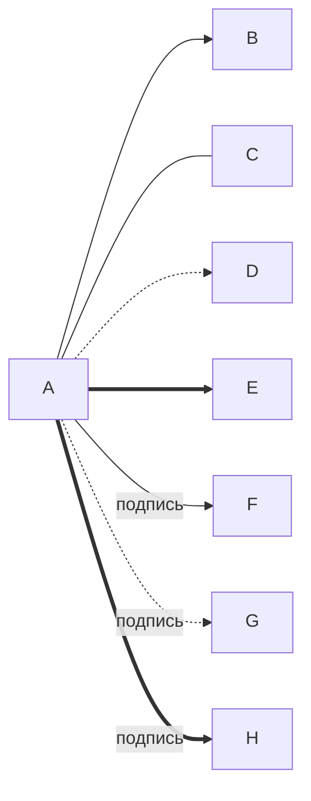
**Подграфы (subgraph):**
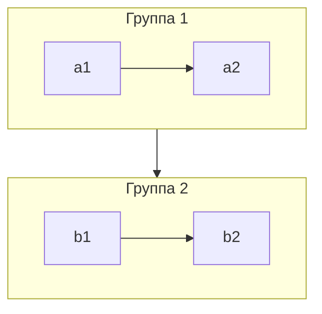

---

### Диаграмма посладовательности
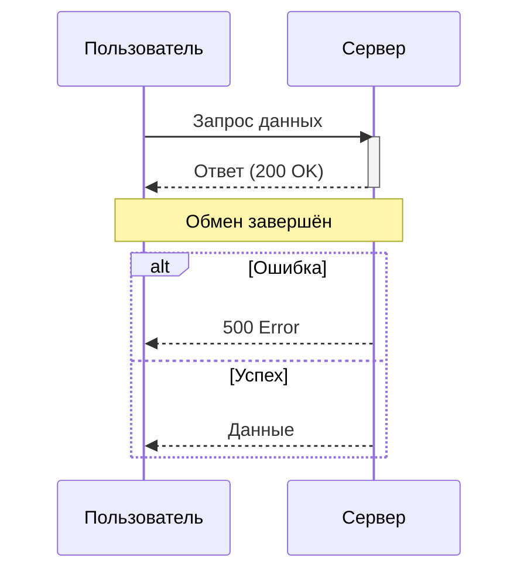
* `->>` — сплошная стрелка с запросом
* `-->>` — пунктирная стрелка (ответ)
* `activate`/`deactivate` — жизненная линия
* `alt/else/end` — условные ветки
* `loop`, `par`, `Note` — доп. блоки
---
### Диаграмма класса
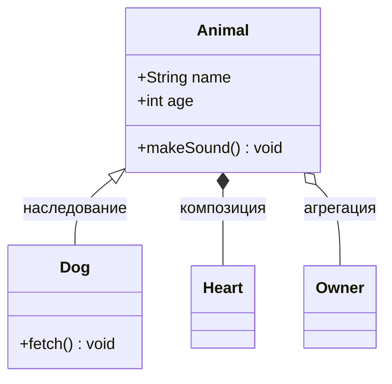
* `<|--` наследование, `*--` композиция, `o--` агрегация, `-->` ассоциация
* `+`/`-`/`#` — public/private/protected

---
### Диаграмма Ганта
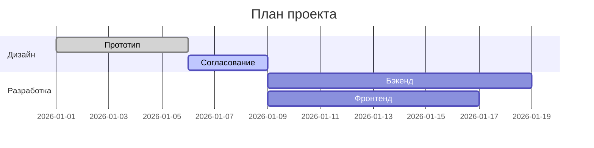
---
### Граф зависимостей
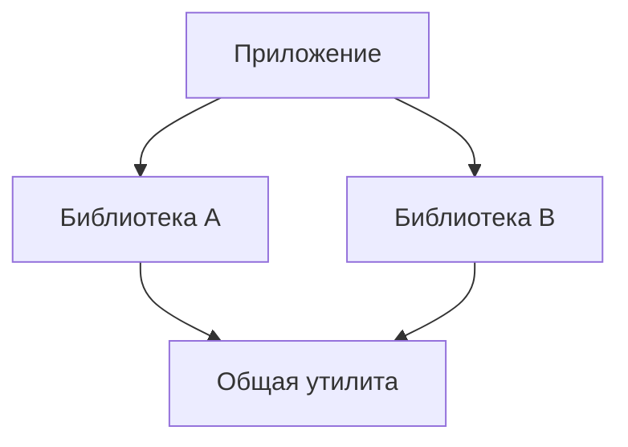
Обычно используется `flowchart` с направлением `TD`, где узлы — модули/пакеты, а рёбра — зависимости "использует".

---

### Диаграмма состояний
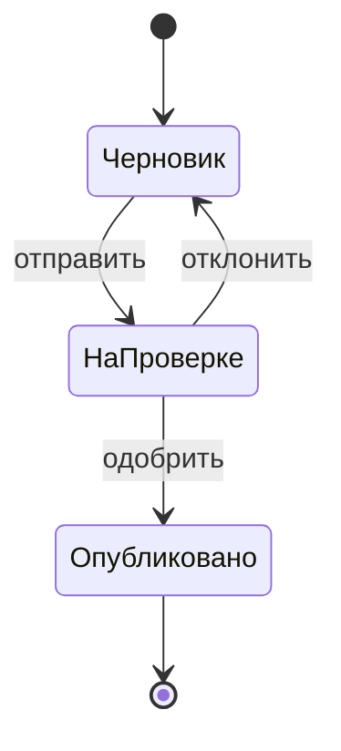
* `[*]` — начальное/конечное состояние
* `state "Описание" as X` — псевдонимы
* Можно вкладывать составные состояния через `state X { ... }`

---
### Юзер-джайрни
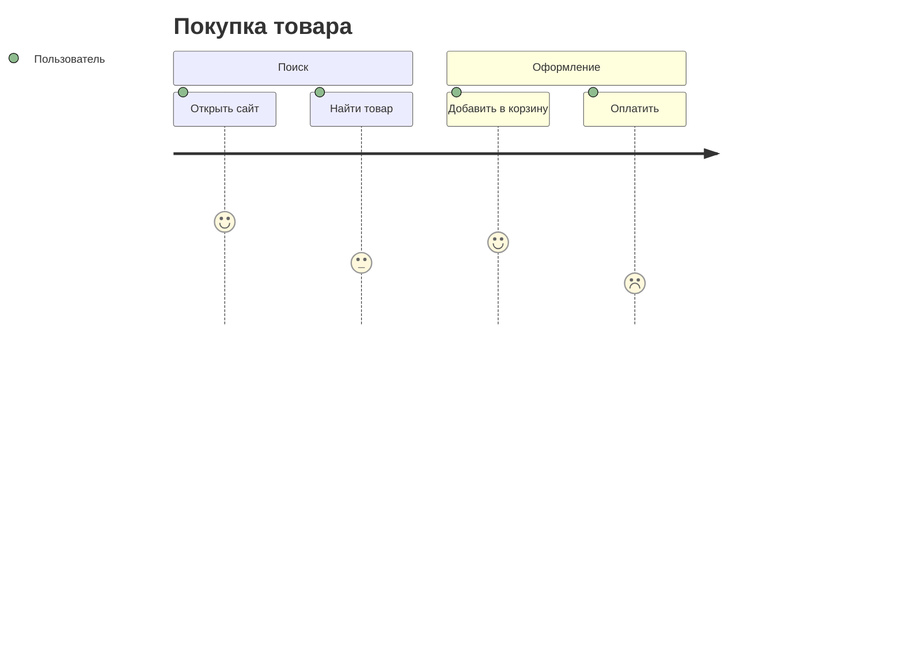
Числа (1–5) — уровень удовлетворённости на каждом шаге.

---

### Кастомизация стилей
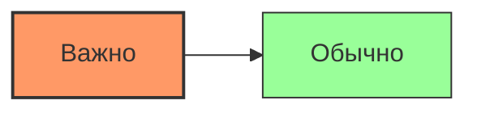
Также можно задать глобальную тему через `%%{init: {'theme':'dark'}}%%` в начале диаграммы.

---
#### Классы CSS
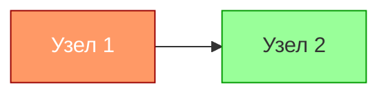
`classDef` создаёт именованный стиль, `:::имя` применяет его к узлу — удобно для повторного использования.

---
#### Интерактивность

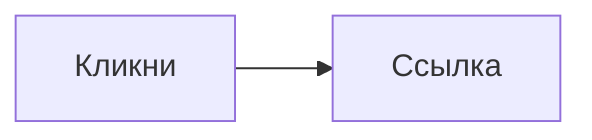
* `click узел callback` — вызов JS-функции
* `click узел "URL"` — переход по ссылке
* Работает только на площадках, где включён `securityLevel: loose`

---
### Круговая диаграмма
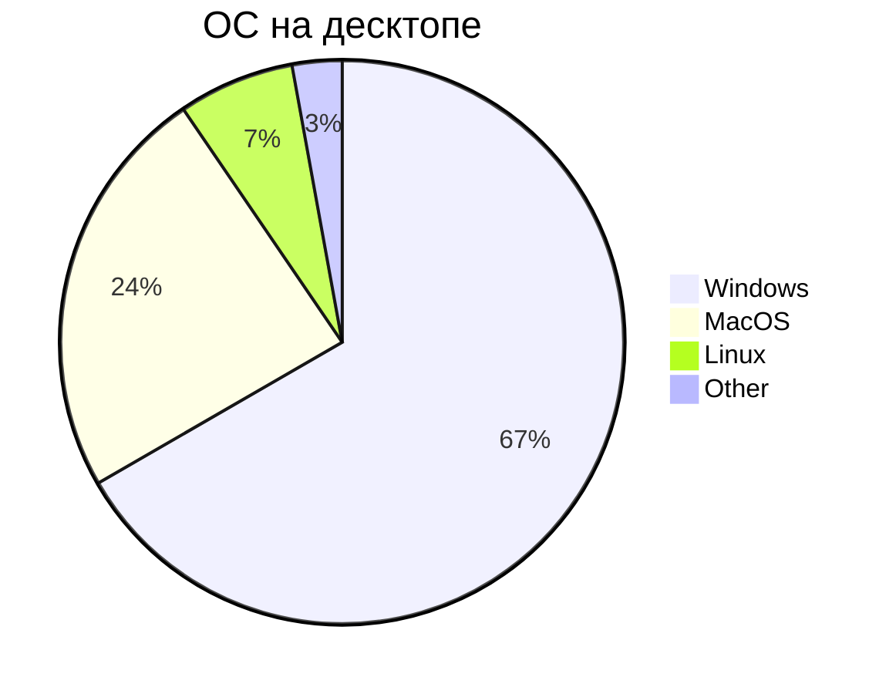
