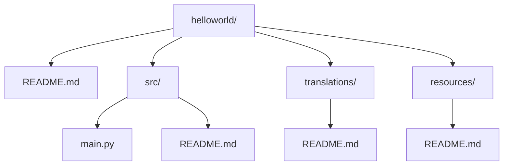

<div align="center">

# 👋 Привет это Readme для моего репозетория

**Мой первый проект с красиво оформленным README на Markdown**


</div>

---

## 📑 Оглавление

- [О проекте](#о-проекте)
- [Скриншоты](#скриншоты)
- [Установка](#установка)
- [Документация](#документация)
- [Пример кода](#пример-кода)
- [Сравнение с похожими проектами](#сравнение-с-похожими-проектами)
- [Структура проекта](#структура-проекта)
- [Контакты](#контакты)

---

## О проекте

Это **учебный проект**, созданный в рамках самостоятельной работы по контролю версий и Markdown. Программа выводит на экран приветствие — ~~но на самом деле~~ цель работы куда шире: научиться оформлять `README.md` так, чтобы им было приятно пользоваться.

> Если тебе понравился проект — не забудь поставить 5⭐ на GitHub, а лучше мне в журнал!

---

## Скриншоты
Тут пока ничего нет, но потом обязательно появится!


---

## Установка

```bash
git clone https://github.com/username/helloworld.git
cd helloworld
python src/main.py
```

---

## Документация

Все файлы проекта и их README:

1. [Главный README](README.md)
2. [src/README.md](src/README.md) — исходный код программы
3. [translations/README.md](translations/README.md) — переводы проекта
4. [translations/resources/README.md](translations/resources/README.md) — изображения и медиафайлы

Файлы будут дополянтся по мере работы❤️

---

## Пример кода

```python
print("Hello, World!")
```

---

## Сравнение с похожими проектами

| Проект       | Язык       | Звёзды ⭐ | Активная разработка |
|--------------|------------|-----------|----------------------|
| **Readme** (этот) | Python | — | ✅ |
| Lazyjournal  | Go         | 1k+       | ✅ |
| GitType      | Rust       | 500+      | ✅ |

---

## Структура проекта



---

<div align="center">

Сделано с ❤️ в рамках учебного курсаб, буду обновлять всё по мере учебы.

</div>

Контакты:
---

## 📬 Контакты

Если хочешь связаться со мной — welcome:

- 🎮 **Steam:** [lokifarm](https://steamcommunity.com/id/lokifarm/)
- 💬 **Discord:** `lokifarm_`
- ✈️ **Telegram:** [@lokifarm](https://t.me/lokifarm)
- 🎵 **Spotify:** [профиль](https://open.spotify.com/user/31y6aiybxh5iaghsoa5oiynex574)

---