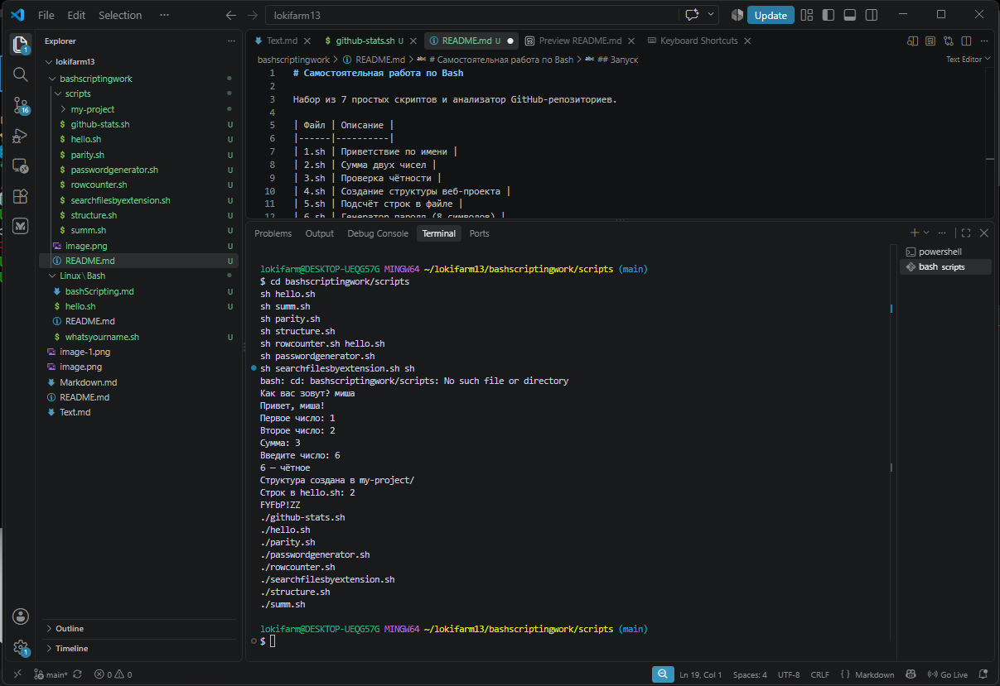

# Самостоятельная работа по Bash

Набор из 7 простых скриптов и анализатор GitHub-репозиториев.

| Файл | Описание |
|------|----------|
| 1.sh | Приветствие по имени |
| 2.sh | Сумма двух чисел |
| 3.sh | Проверка чётности |
| 4.sh | Создание структуры веб-проекта |
| 5.sh | Подсчёт строк в файле |
| 6.sh | Генератор пароля (8 символов) |
| 7.sh | Поиск файлов по расширению |
| github-stats.sh | Статистика репозитория GitHub (цветной вывод) |

## Запуск
`sh 1.sh` (Git-Bash) или `./github-stats.sh owner/repo` (Ubuntu WSL).

